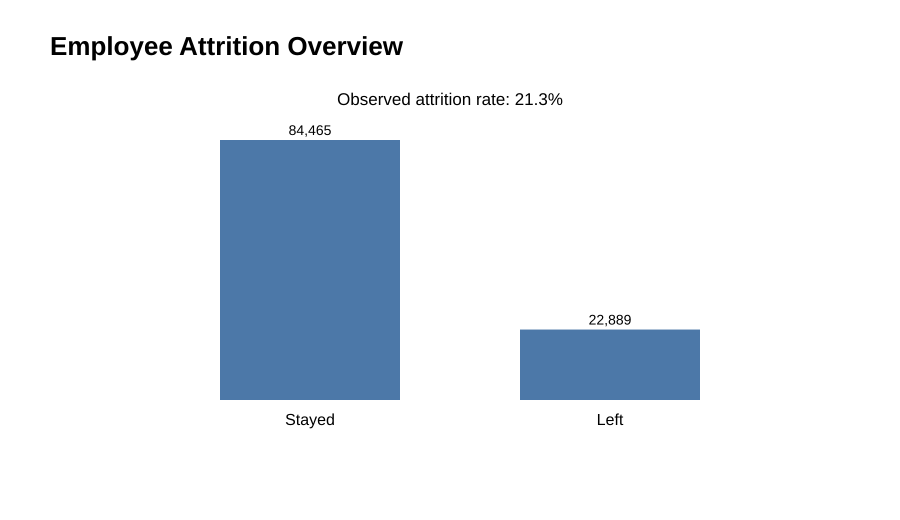
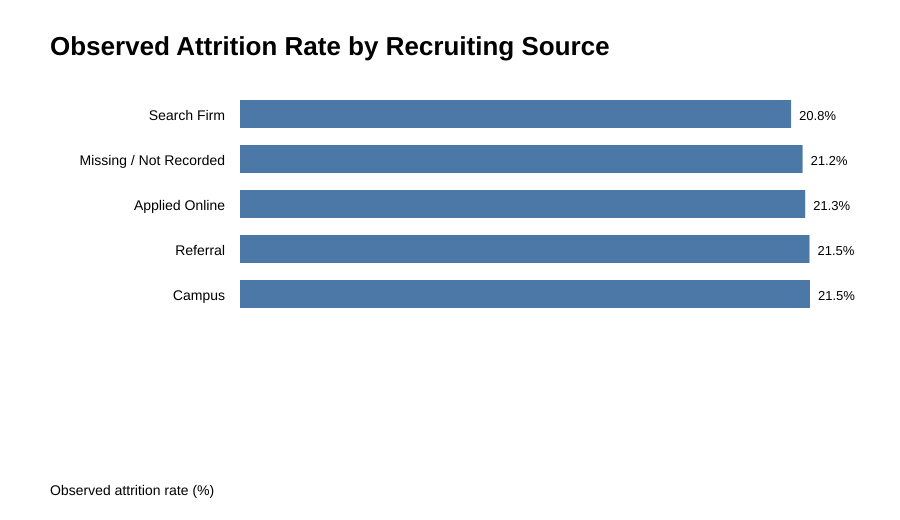
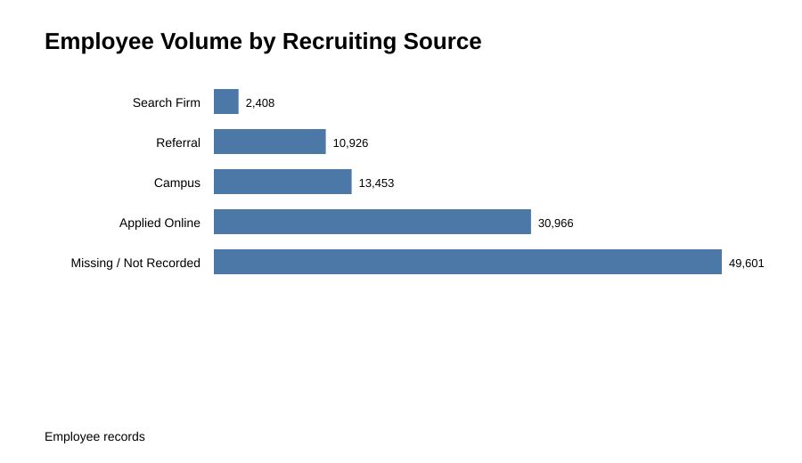
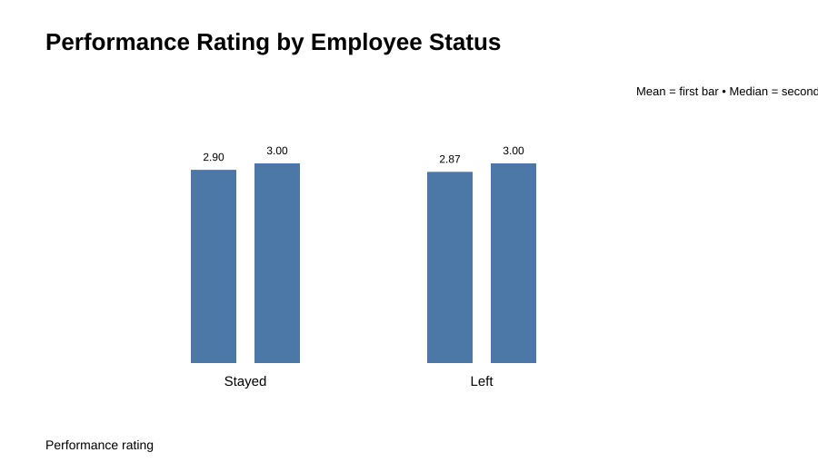
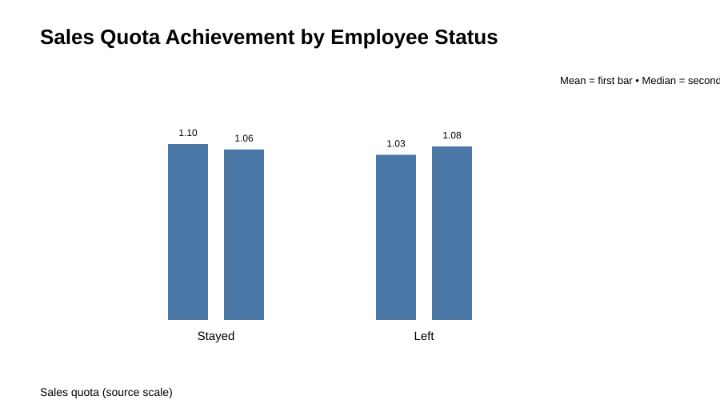
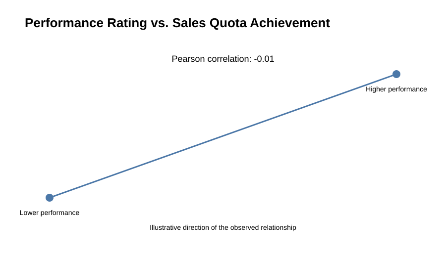
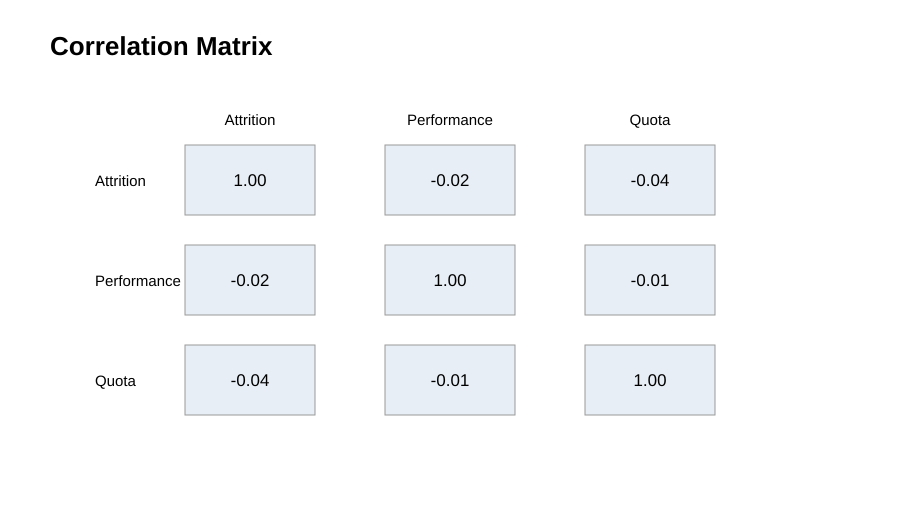

# HR Analytics: Recruitment, Performance & Attrition

## Business Problem

Employee attrition can increase hiring costs, create productivity gaps, and lead to the loss of trained talent.

This project analyzes **107K+ employee records** across recruitment source, performance rating, sales quota achievement, and attrition to answer:

> **What observable patterns in the available workforce and recruitment data can support better HR reporting, recruitment-channel evaluation, and retention monitoring?**

The analysis is descriptive/diagnostic. It identifies patterns and associations in the available data and **does not make causal or predictive claims**.

---

## Business Questions

1. What is the overall observed attrition rate?
2. How does observed attrition vary across recruiting sources?
3. How complete is the recruiting-source data?
4. How do performance ratings and sales quota achievement differ between employees who stayed and those who left?
5. What HR actions can reasonably be recommended from the available evidence?

---

## Analytical Workflow

```text
Raw Data
   ↓
Data Validation
   ↓
Data Preparation
   ↓
Workforce KPIs
   ↓
Attrition Analysis
   ↓
Recruitment-Source Analysis
   ↓
Performance & Quota Analysis
   ↓
Business Insights
   ↓
HR Recommendations
```

---

## Data & Data Quality

The dataset contains four original fields:

| Field | Description |
|---|---|
| `attrition` | Raw numeric attrition indicator |
| `performance_rating` | Employee performance rating |
| `sales_quota_pct` | Sales quota achievement in the source scale |
| `recruiting_source` | Recorded recruitment channel |

### Key validation findings

- **107,354 records** are available.
- Duplicate rows were checked.
- Recruiting-source information is missing for a substantial share of records.
- The raw attrition field contains small numeric deviations around the expected 0/1 values.
- Performance and quota fields contain values outside conventional assumptions, so they are **not silently clipped or deleted**.
- Business definitions are required before creating additional thresholds or transformations for performance and quota.

### Attrition standardization

The raw `attrition` field is preserved. A separate `attrition_flag` is created using a 0.5 threshold:

- `>= 0.5` → **Left**
- `< 0.5` → **Stayed**

This standardized flag is used consistently for attrition-rate calculations.

### Missing recruitment source

Missing recruiting-source values are retained as **Missing / Not Recorded** rather than removed. This keeps the data-quality issue visible and prevents the analysis from silently changing the workforce composition.

---

## Key Business Insights

### 1. Recruitment source is not sufficient to explain attrition

Observed attrition varies across recruiting sources, but recruitment source alone should not be treated as an explanation for employee turnover.

A lower observed attrition rate for a source is a **signal to investigate**, not proof that the channel produces better long-term hires.

**Business implication:** Evaluate recruitment channels using multiple outcomes such as retention, employee performance, hiring volume, time-to-fill, and cost-per-hire.

### 2. Recruitment-source completeness is a major reporting issue

A large portion of records has no recorded recruitment source.

**Business implication:** Improving source capture and standardizing recruitment-channel categories should be a priority before making strong channel-level decisions.

### 3. Performance provides workforce context

Performance ratings differ between employees who stayed and those who left. These differences describe the observed workforce pattern but do not establish that performance causes or prevents attrition.

**Business implication:** Performance should be monitored alongside retention and employee context rather than interpreted in isolation.

### 4. Sales quota provides additional context

Sales quota achievement is compared across employee status and against performance rating. Because the dataset does not provide a formal business definition of the quota field, the project retains its source scale and avoids inventing unsupported target bands.

**Business implication:** Confirm the metric definition before using quota thresholds in operational HR reporting or predictive analysis.

---

## Visual Analysis

The repository includes the analysis visuals below. They are generated from the project dataset and are provided as version-controlled SVG assets so they render directly on GitHub.

### Employee Attrition Overview



### Observed Attrition Rate by Recruiting Source



### Employee Volume by Recruiting Source



### Performance Rating by Employee Status



### Sales Quota Achievement by Employee Status



### Performance Rating vs. Sales Quota Achievement



### Correlation Matrix



The visual analysis is designed to support business interpretation rather than chart volume.

---

## HR Recommendations

### 1. Improve recruitment-source capture

Make recruitment source consistently recorded and standardize source categories.

### 2. Use a recruitment-channel scorecard

Evaluate channels using:

**Retention + Performance + Hiring Volume + Time-to-Fill + Cost-per-Hire**

rather than attrition alone.

### 3. Monitor retention by employee context

Future analysis should incorporate variables such as:

- Tenure
- Department
- Job role
- Manager
- Compensation
- Promotion history
- Workload
- Employee engagement

### 4. Validate business definitions before deeper analysis

Confirm the definitions and units of `performance_rating` and `sales_quota_pct` before creating business thresholds, benchmarks, or predictive models.

### 5. Build on this analysis with richer data

The current dataset is appropriate for descriptive HR analytics. A richer employee-level dataset would support stronger diagnostic analysis and, after data-quality validation, potential predictive work.

---

## Analytical Limitations

This project does **not** claim that:

- One recruiting source causes higher or lower attrition.
- One recruitment source is definitively the best.
- Higher performance prevents employees from leaving.
- Higher quota achievement causes better retention.
- Recruitment source alone can predict employee turnover.

The dataset contains only four original variables, and missing recruitment-source information limits channel-level interpretation.

---

## Final Takeaway

> **Recruitment source provides useful signals about employee retention, but it is not strong enough on its own to explain attrition. Better recruitment-source tracking and richer employee-level data can help HR make more informed hiring and retention decisions.**

---

## Tools & Skills

**Python | Pandas | NumPy | Matplotlib | Seaborn | Data Cleaning | Exploratory Data Analysis | KPI Reporting | HR Analytics | Business Analysis | Insight Communication**

---

## Project Structure

```text
HR-analysis/
│
├── HR Analytics.ipynb
├── Recruitment_Data_updated.csv
├── README.md
└── visuals/
    ├── attrition_overview.svg
    ├── attrition_by_source.svg
    ├── employee_volume_by_source.svg
    ├── performance_by_status.svg
    ├── quota_by_status.svg
    ├── performance_vs_quota.svg
    └── correlation_matrix.svg
```

---

## What This Project Demonstrates

**Data Validation → Data Preparation → KPI Analysis → Exploratory Analysis → Business Interpretation → HR Recommendations**

The emphasis is on **analytical accuracy, business thinking, reproducibility, and responsible interpretation of data**.
